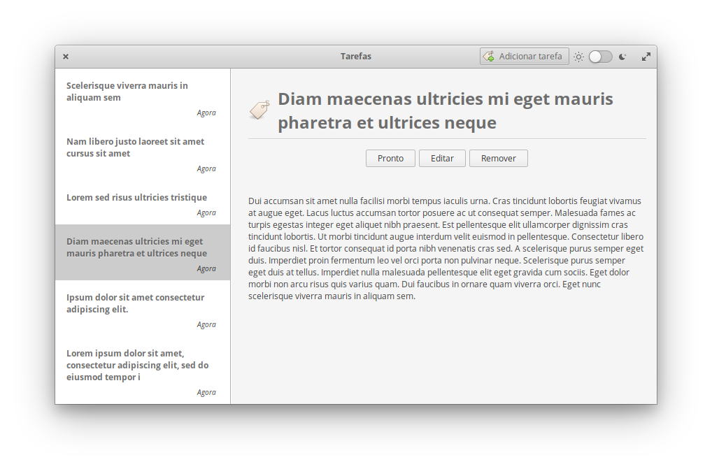

# Tasks

Ideal for managing daily tasks



## Building and Installation

You'll need the following dependencies:
* libgtk-3-dev
* libgee-0.8-dev
* glib-2.0
* libsqlite3-dev
* libgranite-dev (>=0.5)
* meson
* valac >= 0.40.3

## Building

```
meson build && cd build
meson configure -Dprefix=/usr
sudo ninja install
com.github.juarezfranco.tarefas-desktop
```

Made with ❤ in Brazil
